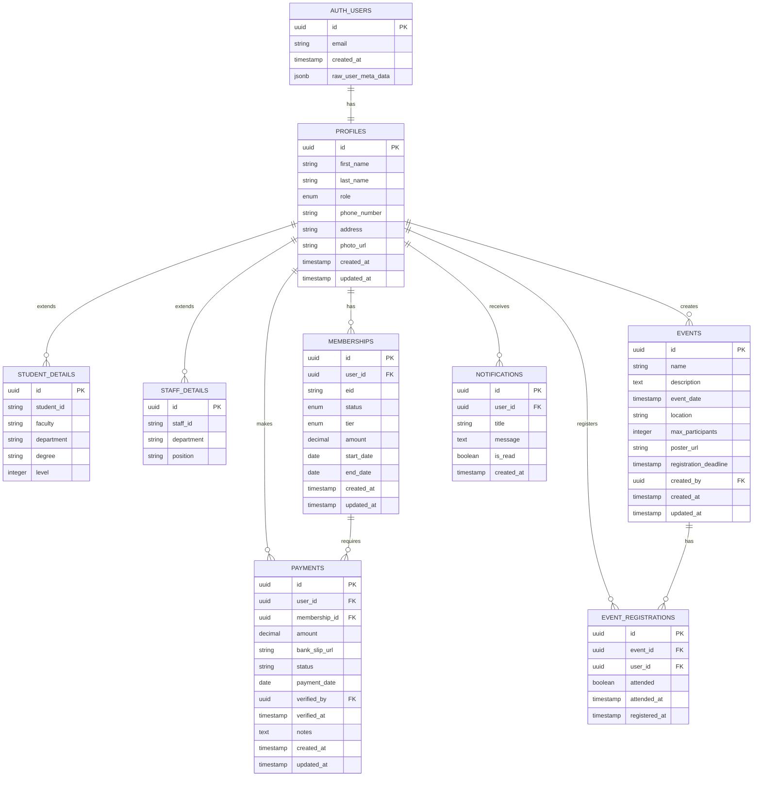

# Complete Supabase Database Setup Guide for I-Team Society Management System

## Overview

This guide provides a comprehensive step-by-step approach to setting up a new Supabase database for the I-Team Society Management System - a React-based application with role-based access control, membership management, event handling, and payment processing.

## System Architecture

The system follows a **Frontend Application** architecture pattern built on:

- **React 18.3.1** with TypeScript
- **Vite** for build tooling
- **Supabase** as Backend-as-a-Service
- **Role-based Access Control** (Admin, Staff, Student)
- **Real-time features** with Supabase subscriptions

## Database Schema Design

### Entity Relationship Diagram



## Step 1: Create Supabase Project

### 1.1 Sign Up and Create Project

1. **Navigate to Supabase**

   - Go to [https://supabase.com](https://supabase.com)
   - Click "Start your project" or "Sign In"
   - Sign up with GitHub, Google, or email

2. **Create New Project**
   - Click "New Project" in dashboard
   - Choose organization (or create one)
   - Fill project details:
     - **Project Name**: `iteam-society-management`
     - **Database Password**: Create strong password (save securely!)
     - **Region**: Choose closest to your location
     - **Pricing Plan**: Free tier for development
   - Click "Create new project"
   - Wait 2-3 minutes for setup completion

### 1.2 Retrieve Project Credentials

1. Go to **Settings** → **API**
2. Copy these critical values:
   - **Project URL**: `https://your-project-id.supabase.co`
   - **Anon (public) key**: `eyJ...` (public key for client-side)
   - **Service role key**: `eyJ...` (admin key - keep secret!)

## Step 2: Database Schema Implementation

### 2.1 Initialize Database Extensions

```sql
-- Enable necessary PostgreSQL extensions
CREATE EXTENSION IF NOT EXISTS "uuid-ossp";
CREATE EXTENSION IF NOT EXISTS "pg_stat_statements";
```

### 2.2 Create Core Tables

Execute the following SQL in Supabase SQL Editor:

```sql
-- =====================================================
-- USER PROFILES TABLE (Extends auth.users)
-- =====================================================
CREATE TABLE profiles (
  id UUID REFERENCES auth.users(id) ON DELETE CASCADE PRIMARY KEY,
  first_name TEXT NOT NULL,
  last_name TEXT NOT NULL,
  role TEXT NOT NULL CHECK (role IN ('student', 'staff', 'admin')) DEFAULT 'student',
  phone_number TEXT,
  address TEXT,
  photo_url TEXT,
  created_at TIMESTAMP WITH TIME ZONE DEFAULT NOW(),
  updated_at TIMESTAMP WITH TIME ZONE DEFAULT NOW()
);

-- =====================================================
-- STUDENT DETAILS TABLE
-- =====================================================
CREATE TABLE student_details (
  id UUID REFERENCES profiles(id) ON DELETE CASCADE PRIMARY KEY,
  student_id TEXT UNIQUE NOT NULL,
  faculty TEXT NOT NULL,
  department TEXT NOT NULL,
  degree TEXT NOT NULL,
  level INTEGER NOT NULL CHECK (level >= 1 AND level <= 5)
);

-- =====================================================
-- STAFF DETAILS TABLE
-- =====================================================
CREATE TABLE staff_details (
  id UUID REFERENCES profiles(id) ON DELETE CASCADE PRIMARY KEY,
  staff_id TEXT UNIQUE NOT NULL,
  department TEXT NOT NULL,
  position TEXT NOT NULL
);

-- =====================================================
-- MEMBERSHIP MANAGEMENT
-- =====================================================
CREATE TYPE membership_status AS ENUM (
  'pending_payment',
  'pending_approval',
  'active',
  'expired',
  'rejected'
);

CREATE TYPE membership_tier AS ENUM ('bronze', 'silver', 'gold');

CREATE TABLE memberships (
  id UUID DEFAULT uuid_generate_v4() PRIMARY KEY,
  user_id UUID REFERENCES profiles(id) ON DELETE CASCADE NOT NULL,
  eid TEXT UNIQUE, -- E-ID generated when approved
  status membership_status NOT NULL DEFAULT 'pending_payment',
  tier membership_tier NOT NULL,
  amount DECIMAL(10,2) NOT NULL,
  start_date DATE,
  end_date DATE,
  created_at TIMESTAMP WITH TIME ZONE DEFAULT NOW(),
  updated_at TIMESTAMP WITH TIME ZONE DEFAULT NOW()
);

-- =====================================================
-- PAYMENT PROCESSING
-- =====================================================
CREATE TABLE payments (
  id UUID DEFAULT uuid_generate_v4() PRIMARY KEY,
  user_id UUID REFERENCES profiles(id) ON DELETE CASCADE NOT NULL,
  membership_id UUID REFERENCES memberships(id) ON DELETE CASCADE,
  amount DECIMAL(10,2) NOT NULL,
  bank_slip_url TEXT NOT NULL,
  status TEXT NOT NULL CHECK (status IN ('pending', 'approved', 'rejected')) DEFAULT 'pending',
  payment_date DATE,
  verified_by UUID REFERENCES profiles(id),
  verified_at TIMESTAMP WITH TIME ZONE,
  notes TEXT,
  created_at TIMESTAMP WITH TIME ZONE DEFAULT NOW(),
  updated_at TIMESTAMP WITH TIME ZONE DEFAULT NOW()
);

-- =====================================================
-- EVENT MANAGEMENT
-- =====================================================
CREATE TABLE events (
  id UUID DEFAULT uuid_generate_v4() PRIMARY KEY,
  name TEXT NOT NULL,
  description TEXT,
  event_date TIMESTAMP WITH TIME ZONE NOT NULL,
  location TEXT,
  max_participants INTEGER,
  poster_url TEXT,
  registration_deadline TIMESTAMP WITH TIME ZONE,
  created_by UUID REFERENCES profiles(id) ON DELETE CASCADE NOT NULL,
  created_at TIMESTAMP WITH TIME ZONE DEFAULT NOW(),
  updated_at TIMESTAMP WITH TIME ZONE DEFAULT NOW()
);

-- =====================================================
-- EVENT REGISTRATIONS
-- =====================================================
CREATE TABLE event_registrations (
  id UUID DEFAULT uuid_generate_v4() PRIMARY KEY,
  event_id UUID REFERENCES events(id) ON DELETE CASCADE NOT NULL,
  user_id UUID REFERENCES profiles(id) ON DELETE CASCADE NOT NULL,
  attended BOOLEAN DEFAULT FALSE,
  attended_at TIMESTAMP WITH TIME ZONE,
  registered_at TIMESTAMP WITH TIME ZONE DEFAULT NOW(),
  UNIQUE(event_id, user_id) -- Prevent duplicate registrations
);

-- =====================================================
-- NOTIFICATION SYSTEM
-- =====================================================
CREATE TABLE notifications (
  id UUID DEFAULT uuid_generate_v4() PRIMARY KEY,
  user_id UUID REFERENCES profiles(id) ON DELETE CASCADE NOT NULL,
  title TEXT NOT NULL,
  message TEXT NOT NULL,
  is_read BOOLEAN DEFAULT FALSE,
  created_at TIMESTAMP WITH TIME ZONE DEFAULT NOW()
);
```

### 2.3 Create Database Functions

```sql
-- =====================================================
-- AUTO-CREATE PROFILE ON USER SIGNUP
-- =====================================================
CREATE OR REPLACE FUNCTION public.handle_new_user()
RETURNS TRIGGER AS $$
BEGIN
  INSERT INTO public.profiles (id, first_name, last_name, role)
  VALUES (
    NEW.id,
    COALESCE(NEW.raw_user_meta_data->>'first_name', ''),
    COALESCE(NEW.raw_user_meta_data->>'last_name', ''),
    COALESCE(NEW.raw_user_meta_data->>'user_type', 'student')
  );
  RETURN NEW;
END;
$$ LANGUAGE plpgsql SECURITY DEFINER;

-- Trigger for new user signup
CREATE TRIGGER on_auth_user_created
  AFTER INSERT ON auth.users
  FOR EACH ROW EXECUTE FUNCTION public.handle_new_user();

-- =====================================================
-- E-ID GENERATION SYSTEM
-- =====================================================
CREATE OR REPLACE FUNCTION generate_eid(user_role TEXT, user_id UUID)
RETURNS TEXT AS $$
DECLARE
  year_part TEXT;
  role_part TEXT;
  sequence_num INTEGER;
BEGIN
  year_part := EXTRACT(YEAR FROM NOW())::TEXT;

  CASE user_role
    WHEN 'student' THEN role_part := 'STU';
    WHEN 'staff' THEN role_part := 'STA';
    WHEN 'admin' THEN role_part := 'ADM';
    ELSE role_part := 'MEM';
  END CASE;

  SELECT COALESCE(MAX(
    CAST(SUBSTRING(eid FROM LENGTH(eid) - 3) AS INTEGER)
  ), 0) + 1
  INTO sequence_num
  FROM memberships
  WHERE eid LIKE 'ITS/' || year_part || '/' || role_part || '/%';

  RETURN 'ITS/' || year_part || '/' || role_part || '/' || LPAD(sequence_num::TEXT, 4, '0');
END;
$$ LANGUAGE plpgsql;

-- =====================================================
-- AUTO-GENERATE E-ID ON MEMBERSHIP APPROVAL
-- =====================================================
CREATE OR REPLACE FUNCTION auto_generate_eid()
RETURNS TRIGGER AS $$
DECLARE
  user_role TEXT;
BEGIN
  IF NEW.status = 'active' AND (OLD.status != 'active' OR OLD.eid IS NULL) AND NEW.eid IS NULL THEN
    SELECT role INTO user_role FROM profiles WHERE id = NEW.user_id;
    NEW.eid := generate_eid(user_role, NEW.user_id);

    IF NEW.start_date IS NULL THEN
      NEW.start_date := CURRENT_DATE;
    END IF;

    IF NEW.end_date IS NULL THEN
      NEW.end_date := CURRENT_DATE + INTERVAL '1 year';
    END IF;
  END IF;

  RETURN NEW;
END;
$$ LANGUAGE plpgsql;

CREATE TRIGGER trigger_auto_generate_eid
  BEFORE UPDATE ON memberships
  FOR EACH ROW EXECUTE FUNCTION auto_generate_eid();

-- =====================================================
-- UTILITY FUNCTIONS FOR ROLE CHECKING
-- =====================================================
CREATE OR REPLACE FUNCTION is_admin(user_id UUID)
RETURNS BOOLEAN AS $$
BEGIN
  RETURN EXISTS (
    SELECT 1 FROM profiles
    WHERE id = user_id AND role = 'admin'
  );
END;
$$ LANGUAGE plpgsql SECURITY DEFINER;

CREATE OR REPLACE FUNCTION is_staff(user_id UUID)
RETURNS BOOLEAN AS $$
BEGIN
  RETURN EXISTS (
    SELECT 1 FROM profiles
    WHERE id = user_id AND role IN ('staff', 'admin')
  );
END;
$$ LANGUAGE plpgsql SECURITY DEFINER;

CREATE OR REPLACE FUNCTION has_active_membership(user_id UUID)
RETURNS BOOLEAN AS $$
BEGIN
  RETURN EXISTS (
    SELECT 1 FROM memberships
    WHERE user_id = has_active_membership.user_id
    AND status = 'active'
    AND end_date > CURRENT_DATE
  );
END;
$$ LANGUAGE plpgsql SECURITY DEFINER;

-- =====================================================
-- UPDATED_AT TRIGGERS
-- =====================================================
CREATE OR REPLACE FUNCTION update_updated_at_column()
RETURNS TRIGGER AS $$
BEGIN
  NEW.updated_at = NOW();
  RETURN NEW;
END;
$$ LANGUAGE plpgsql;

CREATE TRIGGER update_profiles_updated_at
  BEFORE UPDATE ON profiles
  FOR EACH ROW EXECUTE FUNCTION update_updated_at_column();

CREATE TRIGGER update_memberships_updated_at
  BEFORE UPDATE ON memberships
  FOR EACH ROW EXECUTE FUNCTION update_updated_at_column();

CREATE TRIGGER update_events_updated_at
  BEFORE UPDATE ON events
  FOR EACH ROW EXECUTE FUNCTION update_updated_at_column();

CREATE TRIGGER update_payments_updated_at
  BEFORE UPDATE ON payments
  FOR EACH ROW EXECUTE FUNCTION update_updated_at_column();
```

## Step 3: Row Level Security (RLS) Configuration

### 3.1 Enable RLS on All Tables

```sql
-- Enable RLS on all tables
ALTER TABLE profiles ENABLE ROW LEVEL SECURITY;
ALTER TABLE student_details ENABLE ROW LEVEL SECURITY;
ALTER TABLE staff_details ENABLE ROW LEVEL SECURITY;
ALTER TABLE memberships ENABLE ROW LEVEL SECURITY;
ALTER TABLE payments ENABLE ROW LEVEL SECURITY;
ALTER TABLE events ENABLE ROW LEVEL SECURITY;
ALTER TABLE event_registrations ENABLE ROW LEVEL SECURITY;
ALTER TABLE notifications ENABLE ROW LEVEL SECURITY;
```

### 3.2 Create RLS Policies

```sql
-- =====================================================
-- PROFILES POLICIES
-- =====================================================
CREATE POLICY "Users can view own profile" ON profiles
  FOR SELECT USING (auth.uid() = id);

CREATE POLICY "Users can update own profile" ON profiles
  FOR UPDATE USING (auth.uid() = id)
  WITH CHECK (
    auth.uid() = id AND
    -- Prevent role escalation
    role = (SELECT role FROM profiles WHERE id = auth.uid())
  );

CREATE POLICY "Admins can view all profiles" ON profiles
  FOR SELECT USING (
    EXISTS (SELECT 1 FROM profiles WHERE id = auth.uid() AND role = 'admin')
  );

CREATE POLICY "Admins can update all profiles" ON profiles
  FOR UPDATE USING (
    EXISTS (SELECT 1 FROM profiles WHERE id = auth.uid() AND role = 'admin')
  );

-- =====================================================
-- STUDENT DETAILS POLICIES
-- =====================================================
CREATE POLICY "Users can view own student details" ON student_details
  FOR SELECT USING (auth.uid() = id);

CREATE POLICY "Users can insert own student details" ON student_details
  FOR INSERT WITH CHECK (auth.uid() = id);

CREATE POLICY "Staff can view all student details" ON student_details
  FOR SELECT USING (
    EXISTS (SELECT 1 FROM profiles WHERE id = auth.uid() AND role IN ('staff', 'admin'))
  );

-- =====================================================
-- STAFF DETAILS POLICIES
-- =====================================================
CREATE POLICY "Users can view own staff details" ON staff_details
  FOR SELECT USING (auth.uid() = id);

CREATE POLICY "Users can insert own staff details" ON staff_details
  FOR INSERT WITH CHECK (auth.uid() = id);

CREATE POLICY "Admins can view all staff details" ON staff_details
  FOR SELECT USING (
    EXISTS (SELECT 1 FROM profiles WHERE id = auth.uid() AND role = 'admin')
  );

-- =====================================================
-- MEMBERSHIP POLICIES
-- =====================================================
CREATE POLICY "Users can view own membership" ON memberships
  FOR SELECT USING (auth.uid() = user_id);

CREATE POLICY "Users can create own membership" ON memberships
  FOR INSERT WITH CHECK (auth.uid() = user_id);

CREATE POLICY "Staff can view all memberships" ON memberships
  FOR SELECT USING (
    EXISTS (SELECT 1 FROM profiles WHERE id = auth.uid() AND role IN ('staff', 'admin'))
  );

CREATE POLICY "Staff can manage memberships" ON memberships
  FOR UPDATE USING (
    EXISTS (SELECT 1 FROM profiles WHERE id = auth.uid() AND role IN ('staff', 'admin'))
  );

-- =====================================================
-- PAYMENT POLICIES
-- =====================================================
CREATE POLICY "Users can view own payments" ON payments
  FOR SELECT USING (auth.uid() = user_id);

CREATE POLICY "Users can create own payments" ON payments
  FOR INSERT WITH CHECK (auth.uid() = user_id);

CREATE POLICY "Staff can view all payments" ON payments
  FOR SELECT USING (
    EXISTS (SELECT 1 FROM profiles WHERE id = auth.uid() AND role IN ('staff', 'admin'))
  );

CREATE POLICY "Staff can verify payments" ON payments
  FOR UPDATE USING (
    EXISTS (SELECT 1 FROM profiles WHERE id = auth.uid() AND role IN ('staff', 'admin'))
  );

-- =====================================================
-- EVENT POLICIES
-- =====================================================
CREATE POLICY "Everyone can view events" ON events
  FOR SELECT USING (true);

CREATE POLICY "Staff can create events" ON events
  FOR INSERT WITH CHECK (
    EXISTS (SELECT 1 FROM profiles WHERE id = auth.uid() AND role IN ('staff', 'admin'))
  );

CREATE POLICY "Event creators can update own events" ON events
  FOR UPDATE USING (auth.uid() = created_by);

CREATE POLICY "Admins can manage all events" ON events
  FOR ALL USING (
    EXISTS (SELECT 1 FROM profiles WHERE id = auth.uid() AND role = 'admin')
  );

-- =====================================================
-- EVENT REGISTRATION POLICIES
-- =====================================================
CREATE POLICY "Users can view own registrations" ON event_registrations
  FOR SELECT USING (auth.uid() = user_id);

CREATE POLICY "Users can register for events" ON event_registrations
  FOR INSERT WITH CHECK (auth.uid() = user_id);

CREATE POLICY "Event creators can view registrations" ON event_registrations
  FOR SELECT USING (
    EXISTS (SELECT 1 FROM events WHERE id = event_id AND created_by = auth.uid())
  );

CREATE POLICY "Staff can view all registrations" ON event_registrations
  FOR SELECT USING (
    EXISTS (SELECT 1 FROM profiles WHERE id = auth.uid() AND role IN ('staff', 'admin'))
  );

-- =====================================================
-- NOTIFICATION POLICIES
-- =====================================================
CREATE POLICY "Users can view own notifications" ON notifications
  FOR SELECT USING (auth.uid() = user_id);

CREATE POLICY "Users can update own notifications" ON notifications
  FOR UPDATE USING (auth.uid() = user_id);

CREATE POLICY "Staff can create notifications" ON notifications
  FOR INSERT WITH CHECK (
    EXISTS (SELECT 1 FROM profiles WHERE id = auth.uid() AND role IN ('staff', 'admin'))
  );
```

## Step 4: Storage Bucket Configuration

### 4.1 Create Storage Buckets

```sql
-- =====================================================
-- PROFILE PHOTOS BUCKET
-- =====================================================
INSERT INTO storage.buckets (id, name, public, file_size_limit, allowed_mime_types)
VALUES (
  'profile_photos',
  'profile_photos',
  true,
  2097152, -- 2MB
  ARRAY['image/jpeg', 'image/png', 'image/gif', 'image/webp']
) ON CONFLICT (id) DO NOTHING;

-- =====================================================
-- PAYMENT SLIPS BUCKET
-- =====================================================
INSERT INTO storage.buckets (id, name, public, file_size_limit, allowed_mime_types)
VALUES (
  'payment_slips',
  'payment_slips',
  false, -- Private bucket
  5242880, -- 5MB
  ARRAY['image/jpeg', 'image/png', 'image/gif', 'image/webp', 'application/pdf']
) ON CONFLICT (id) DO NOTHING;

-- =====================================================
-- EVENT POSTERS BUCKET
-- =====================================================
INSERT INTO storage.buckets (id, name, public, file_size_limit, allowed_mime_types)
VALUES (
  'event_posters',
  'event_posters',
  true,
  10485760, -- 10MB
  ARRAY['image/jpeg', 'image/png', 'image/gif', 'image/webp']
) ON CONFLICT (id) DO NOTHING;
```

### 4.2 Storage Policies

```sql
-- =====================================================
-- PROFILE PHOTOS POLICIES
-- =====================================================
CREATE POLICY "Users can upload own profile photos" ON storage.objects
  FOR INSERT WITH CHECK (
    bucket_id = 'profile_photos' AND
    auth.uid()::text = (storage.foldername(name))[1]
  );

CREATE POLICY "Users can update own profile photos" ON storage.objects
  FOR UPDATE USING (
    bucket_id = 'profile_photos' AND
    auth.uid()::text = (storage.foldername(name))[1]
  );

CREATE POLICY "Public can view profile photos" ON storage.objects
  FOR SELECT USING (bucket_id = 'profile_photos');

-- =====================================================
-- PAYMENT SLIPS POLICIES
-- =====================================================
CREATE POLICY "Users can upload own payment slips" ON storage.objects
  FOR INSERT WITH CHECK (
    bucket_id = 'payment_slips' AND
    auth.uid()::text = (storage.foldername(name))[1]
  );

CREATE POLICY "Users can view own payment slips" ON storage.objects
  FOR SELECT USING (
    bucket_id = 'payment_slips' AND
    auth.uid()::text = (storage.foldername(name))[1]
  );

CREATE POLICY "Staff can view all payment slips" ON storage.objects
  FOR SELECT USING (
    bucket_id = 'payment_slips' AND
    EXISTS (SELECT 1 FROM profiles WHERE id = auth.uid() AND role IN ('staff', 'admin'))
  );

-- =====================================================
-- EVENT POSTERS POLICIES
-- =====================================================
CREATE POLICY "Staff can upload event posters" ON storage.objects
  FOR INSERT WITH CHECK (
    bucket_id = 'event_posters' AND
    EXISTS (SELECT 1 FROM profiles WHERE id = auth.uid() AND role IN ('staff', 'admin'))
  );

CREATE POLICY "Public can view event posters" ON storage.objects
  FOR SELECT USING (bucket_id = 'event_posters');
```

## Step 5: Performance Optimization

### 5.1 Create Indexes

```sql
-- =====================================================
-- PERFORMANCE INDEXES
-- =====================================================
CREATE INDEX idx_profiles_role ON profiles(role);
CREATE INDEX idx_profiles_email ON profiles USING hash((SELECT email FROM auth.users WHERE id = profiles.id));

CREATE INDEX idx_memberships_user_id ON memberships(user_id);
CREATE INDEX idx_memberships_status ON memberships(status);
CREATE INDEX idx_memberships_eid ON memberships(eid);
CREATE INDEX idx_memberships_active ON memberships(user_id, status) WHERE status = 'active';

CREATE INDEX idx_payments_user_id ON payments(user_id);
CREATE INDEX idx_payments_membership_id ON payments(membership_id);
CREATE INDEX idx_payments_status ON payments(status);

CREATE INDEX idx_events_date ON events(event_date);
CREATE INDEX idx_events_creator ON events(created_by);

CREATE INDEX idx_event_registrations_event ON event_registrations(event_id);
CREATE INDEX idx_event_registrations_user ON event_registrations(user_id);
CREATE INDEX idx_event_registrations_unique ON event_registrations(event_id, user_id);

CREATE INDEX idx_notifications_user ON notifications(user_id);
CREATE INDEX idx_notifications_read ON notifications(user_id, is_read);

-- =====================================================
-- UNIQUE CONSTRAINTS
-- =====================================================
CREATE UNIQUE INDEX unique_active_membership
ON memberships(user_id)
WHERE status IN ('active', 'pending_approval');
```

## Step 6: Environment Configuration

### 6.1 Create Environment Variables

Create `.env.local` file in your project root:

```env
# Supabase Configuration
VITE_SUPABASE_URL=https://your-project-id.supabase.co
VITE_SUPABASE_ANON_KEY=your-anon-key-here

# Optional: Service Role Key (for admin operations)
SUPABASE_SERVICE_ROLE_KEY=your-service-role-key-here

# Email Service (if using Resend)
VITE_RESEND_API_KEY=your-resend-api-key
```

### 6.2 Authentication Settings

In Supabase Dashboard:

1. **Go to Authentication** → **Settings**
2. **Configure Site URL**: `http://localhost:8080` (development)
3. **Add Redirect URLs**: Add production URLs when deploying
4. **Enable Email Confirmation**: ✅ Recommended
5. **Configure Email Templates**: Customize as needed

## Step 7: Data Verification and Testing

### 7.1 Verify Setup

```sql
-- =====================================================
-- VERIFICATION QUERIES
-- =====================================================

-- Check table creation
SELECT
  schemaname,
  tablename,
  tableowner
FROM pg_tables
WHERE schemaname = 'public'
ORDER BY tablename;

-- Check RLS status
SELECT
  schemaname,
  tablename,
  rowsecurity
FROM pg_tables
WHERE schemaname = 'public';

-- Check storage buckets
SELECT id, name, public FROM storage.buckets;

-- Test functions
SELECT generate_eid('student', gen_random_uuid());
SELECT is_admin(gen_random_uuid());
```

### 7.2 Sample Data Population

```sql
-- =====================================================
-- SAMPLE DATA (Optional for testing)
-- =====================================================

-- Create sample admin user (after registration)
-- UPDATE profiles SET role = 'admin' WHERE email = 'admin@example.com';

-- Sample membership tiers data
INSERT INTO memberships (user_id, tier, amount, status) VALUES
-- Add sample data after user registration
```

## Step 8: Monitoring and Maintenance

### 8.1 Database Monitoring

- **Monitor Performance**: Use Supabase Dashboard → Database → Logs
- **Track Storage Usage**: Storage → Usage
- **Authentication Metrics**: Authentication → Users

### 8.2 Regular Maintenance Tasks

```sql
-- =====================================================
-- MAINTENANCE QUERIES
-- =====================================================

-- Clean up expired sessions
DELETE FROM auth.sessions WHERE expires_at < NOW();

-- Archive old notifications (older than 6 months)
DELETE FROM notifications
WHERE created_at < NOW() - INTERVAL '6 months' AND is_read = true;

-- Update membership statuses
UPDATE memberships
SET status = 'expired'
WHERE status = 'active' AND end_date < CURRENT_DATE;
```

## Troubleshooting

### Common Issues

1. **RLS Policy Errors**

   - Ensure user is authenticated: `SELECT auth.uid()`
   - Verify policy logic with sample queries
   - Use `SECURITY DEFINER` for functions if needed

2. **Storage Upload Failures**

   - Check file size limits
   - Verify MIME type restrictions
   - Ensure proper folder structure: `user_id/filename`

3. **Performance Issues**
   - Monitor slow queries in Dashboard
   - Add missing indexes
   - Consider query optimization

### Emergency Fixes

If experiencing issues, run the emergency cleanup:

```sql
-- Temporarily disable RLS for debugging (DEV ONLY)
-- ALTER TABLE profiles DISABLE ROW LEVEL SECURITY;

-- Re-enable after fixing
-- ALTER TABLE profiles ENABLE ROW LEVEL SECURITY;
```

Your I-Team Society Management System database is now fully configured and ready for development!
